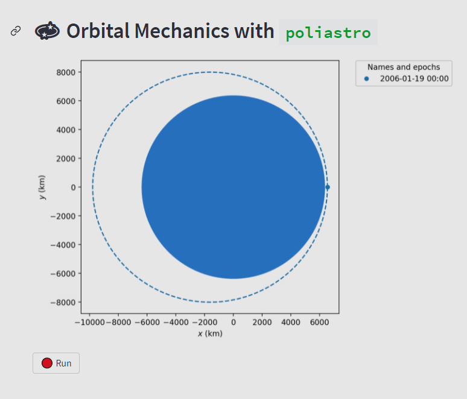

# orbital

Orbital playground using `poliastro` and `streamlit`.



Rendering with matplotlib is slow (90 ms) vs. altair (5 ms).

## Dev Environment

* Ubuntu / WSL
```
conda create -n orbital python=3.9 jupyter
conda activate orbital  
pip install nbdev
git clone https://github.com/lukexyz/orbital.git  
pip install -r requirements.txt  
```

### Nbdev commands  

#### 1. 🏗️ **Build lib** from notebooks  
> `nbdev_build_lib` 


#### 2. 📝 **Build docs** from notebooks  
> `nbdev_build_docs` 